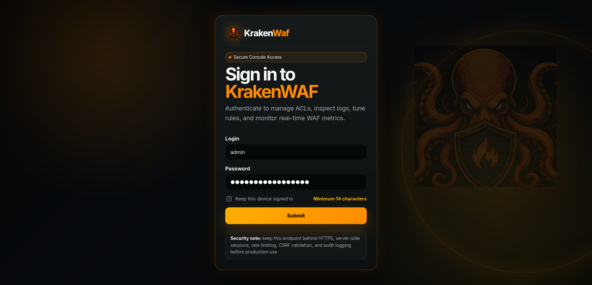
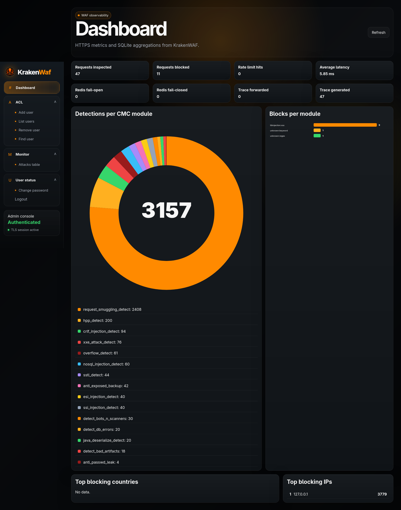
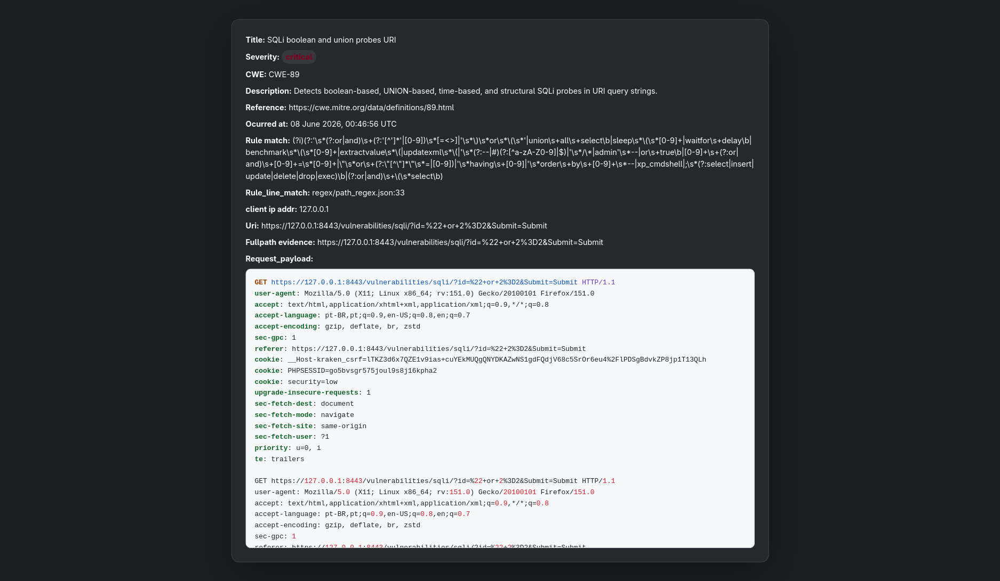

# Kraken UI

> The secure-by-default admin console for [KrakenWAF](https://github.com/Orangewarrior/KrakenWaf) — built in Rust.

**Current version: 0.14.0**

Kraken UI is a small, hardened web application for operating a KrakenWAF
deployment: manage operators, watch blocked attacks in real time, and read live
WAF metrics from a single TLS-only console. It is written in Rust with
[Axum](https://github.com/tokio-rs/axum), [Askama](https://github.com/askama-rs/askama)
and [SeaORM](https://www.sea-ql.org/SeaORM/), ships no CDN assets and runs no
inline JavaScript.

- **Secure by default.** TLS is mandatory, sessions and CSRF cookies use the
  `__Host-` prefix, and a strict Content-Security-Policy forbids inline
  scripts and styles. Logins are rate-limited and timing-equalised, sessions are
  persisted and revocable, and GCRA request limits with SQLite or Redis guard
  every route.
- **Defence in depth on passwords.** Argon2id hashing (libsodium-compatible)
  wrapped in an XChaCha20-Poly1305 envelope with a per-user AAD, so a hash can
  never be replayed against another account; plaintext is held in `Zeroizing`.
- **Optional two-factor authentication.** Any operator can protect their account
  with a TOTP authenticator app and single-use recovery codes. Secrets and codes
  are sealed in the same per-user envelope as passwords. See
  [docs/mfa.md](docs/mfa.md).
- **Auditable.** Authentication and operator-administration events are written
  to a dedicated `audit.jsonl`, and the WAF metrics channel is pinned to the
  certificate you configure and authenticated with KrakenWAF's shared bearer
  token.
- **Admin-controlled stable updates.** Administrators can download, validate,
  compile and install the latest published Kraken UI release from the Updates
  menu. Runtime databases and local configuration remain untouched.
- **No surprises in your dependency tree.** Every transitive licence exception
  is pinned in `deny.toml`, and CI runs Clippy, Semgrep, CodeQL, cargo-audit,
  cargo-deny and OSV Scanner on every push.

---

## Why Kraken UI?

Most admin panels lean on a pile of JavaScript and a relaxed security posture.
Kraken UI takes the opposite approach: the smallest sensible attack surface, no
third-party runtime in the browser, and security controls that fail closed. If
the security headers file has a typo, the server refuses to start. If no
encryption key is configured, it will not boot. If the password policy is not
met, the account is never created.

It is a good fit if you run KrakenWAF and want a console you can reason about
end to end.

## Quick start

You will need **Rust 1.95 or newer** (edition 2024) and OpenSSL for generating
keys. `rust-toolchain.toml` pins the tested compiler.

**1. Configure `conf/setup.yaml`** with your certificate, private key, TLS
address, the UI's own database and the KrakenWAF alerts database:

```yaml
cert-ca: certs/ca.pem
key: certs/key.pem
listen: "127.0.0.1:3443"
db-local: db/kraken-ui.sqlite
db_local: "../KrakenWAF/logs/db/vulns_alert.db"
waf-endpoint: "https://127.0.0.1:4343"
waf-cert-ca: "../KrakenWAF/certs/cert.pem"
log-dir: log
session-timeout-minutes: 30
```

**2. Review `conf/ratelimit.yaml`.** The defaults enable local
`axum-governor` GCRA plus persistent SQLite state at
`db/kraken-ui-ratelimit.sqlite`. The same file controls the sustained rate,
burst, per-IP concurrency, TLS handshake timeout and accepted request timeout.
Redis can coordinate multiple replicas and requires TLS plus file-first ACL
credentials. See [Rate limiting](docs/rate-limiting.md).

**3. Provide a 32-byte XChaCha20-Poly1305 key** as Base64. For local
development an environment variable is fine:

```bash
export KRAKEN_UI_PASSWORD_KEY="$(openssl rand -base64 32)"
export KRAKEN_UI_PASSWORD_KEY_ID='primary-v1'
```

**4. Provide the KrakenWAF observability bearer token.** KrakenWAF's dedicated
listener on port `4343` and Kraken UI must resolve the same value:

```bash
export BEARER_PASSWORD="$(openssl rand -hex 32)"
```

Resolution order is `BEARER_PASSWORD_FILE`,
`/run/secrets/krakenwaf/BEARER_PASSWORD`, then `BEARER_PASSWORD`. When both
services run on the same host, they can read the same mounted secret or systemd
credential. See [WAF bearer authentication](docs/waf-bearer-auth.md) for file,
systemd and troubleshooting examples.

For the UI encryption key in production, prefer a file with `0600` permissions
(the application refuses key files that are readable by group or others):

```bash
openssl rand -base64 32 > /secure/path/kraken-ui-password.key
chmod 600 /secure/path/kraken-ui-password.key
export KRAKEN_UI_PASSWORD_KEY_FILE=/secure/path/kraken-ui-password.key
```

In production, also set a **stable session signing key** (≥ 64 bytes, Base64) so
sessions survive restarts and validate across replicas:

```bash
export KRAKEN_UI_SESSION_KEY="$(openssl rand -base64 64)"
```

**5. Create the first administrator** and run the app:

```bash
export KRAKEN_UI_ADMIN_PASSWORD='Use-A-Unique!Strong9Password'
export KRAKEN_UI_ADMIN_EMAIL='admin@example.invalid'
cargo run
```

The initial username is `admin`. The password is hashed with Argon2id,
encrypted at rest and never written to a log.

Prefer not to put the password in the environment? With an empty operators
table you can bootstrap once from localhost. The endpoint returns `410 Gone`
as soon as any operator exists:

```bash
curl --cacert certs/ca.pem \
  --data-urlencode 'username=admin' \
  --data-urlencode 'email=admin@example.invalid' \
  --data-urlencode 'user_type=admin' \
  --data-urlencode 'password=Use-A-Unique!Strong9Password' \
  https://127.0.0.1:3443/kraken_ui/auth/first_time
```

Then sign in at `https://host:port/kraken_ui/login`.

## What's inside

| Area        | Endpoints |
|-------------|-----------|
| Dashboard   | `/kraken_ui/auth/admin_panel`, `/kraken_ui/auth/dashboard` |
| Operators   | `/kraken_ui/auth/insert_user`, `/delete_user`, `/edit_user`, `/show_user_table` |
| Monitoring  | `/kraken_ui/auth/show_attacks`, `/kraken_ui/auth/view_waf_request/?id=<id>` |
| Account     | `/kraken_ui/auth/update_password`, `/kraken_ui/auth/mfa` |
| Updates     | `/kraken_ui/auth/update_kraken_ui` (administrators only) |
| Two-factor  | `/kraken_ui/auth/mfa_challenge`, `/kraken_ui/auth/mfa_verify` (sign-in challenge) |

### Roles

| Role | Can sign in | Sees |
|------|-------------|------|
| `admin`    | yes | Everything: dashboard, attacks, the single-attack detail view, the full ACL menu and self-service password change. |
| `operator` | yes | The same dashboard, attacks table, attack detail view and password change as an admin — but **without** the ACL menu. |
| `auditor`  | not yet | Reserved. Already authorised for the read-only attack detail view; sign-in is not implemented. |

The sidebar is defined once in `src/view/templates/admin_sidebar.html`; the ACL
section is rendered only when the controller passes `show_acl = true` (admins).

### The single-attack detail view

Clicking the **ID** or **client IP** column of the attacks table opens
`view_waf_request` in a new tab. It shows the full finding — title, colour-coded
severity, CWE, description, reference, a human-readable timestamp, rule match,
client IP, URI and fullpath evidence — and, last, the WAF `request_payload` in a
light-themed, syntax-highlighted code box. The payload is rendered through the
template's default HTML escaping — never Ammonia-stripped, so the exact attacker
bytes are preserved — and highlighted client-side by building DOM nodes only (no
`innerHTML`), so it stays inert within the strict CSP.

## Screenshots

A quick tour of the console — TLS-only, no CDN assets and no inline JavaScript.

### Secure console sign-in

The hardened login: `__Host-` session and CSRF cookies, rate-limited and
timing-equalised authentication, and the 14-character minimum password policy
enforced on both the front end and the back end.



### WAF observability dashboard

Live HTTPS metrics and SQLite aggregations from KrakenWAF: requests inspected
and blocked, average latency, detections per CMC module, blocks per module, and
the top blocking countries and IPs — all charted as local SVG.



### Single-attack detail view

Opened from the attacks table by clicking an attack's **ID** or **client IP**:
the full finding with colour-coded severity, CWE, description, rule match, URI
and the HTML-escaped, syntax-highlighted request/response payload.



## Project layout

```text
src/
├── routes/        # endpoint declarations
├── controllers/   # HTTP handlers: CSRF, sessions, rendering, pagination
├── models/        # SeaORM entities, repositories and the session store
├── services/      # password crypto and WAF metrics boundaries
├── security/      # sanitisation, password policy, headers, CSRF, rate limiting
├── middleware/    # auth, global security headers and the per-IP rate limiter
└── view/          # Askama templates and local assets
```

For the bigger picture, see the [`docs/`](docs/) directory:

- [Architecture](docs/architecture.md) — how the pieces fit together.
- [WAF bearer authentication](docs/waf-bearer-auth.md) — shared token loading,
  port `4343`, systemd and troubleshooting.
- [Source updates](docs/source-updates.md) — admin-only stable release updates,
  preserved files, build requirements and recovery.
- [Security](docs/security.md) — the controls and why they exist.
- [Security review](docs/security-review.md) — standing findings and their status.
- [Database & ACL](docs/database.md) — schema, sessions and routes.
- [Two-factor authentication](docs/mfa.md) — TOTP enrolment, sign-in and recovery.
- [Operations](docs/operations.md) — configuration, env vars, logs and limits.
- [Dependency licences](docs/dependency-licenses.md) — the licence policy.

## Building and testing

```bash
cargo fmt --check
cargo test
cargo clippy --all-targets -- -D warnings
```

All three must pass before a change is merged — they are exactly what CI runs.

## Contributing

Contributions are very welcome, whether that's a bug fix, a documentation
improvement or a new feature. We try to keep the barrier low:

1. **Open an issue first** for anything non-trivial, so we can agree on the
   approach before you spend time on it.
2. **Keep changes focused.** Small, reviewable pull requests get merged faster.
3. **Match the surrounding style.** Run `cargo fmt`, keep Clippy clean and add
   a test when you change behaviour.
4. **Never weaken a security control silently.** If a change relaxes a header,
   a cookie attribute or the password policy, call it out explicitly in the
   pull request description.

Good first contributions: improving error messages, expanding test coverage,
tightening the Content-Security-Policy, or adding documentation. If you are not
sure where to start, open an issue and say hello.

## Security

Found a vulnerability? Please **do not** open a public issue. Email the
maintainers privately so we can fix it before disclosure. The threat model and
the controls in place are documented in [docs/security.md](docs/security.md),
and a standing review of known gaps lives in
[docs/security-review.md](docs/security-review.md).

## Licence

Kraken UI is released under the [MIT](LICENSE) licence
