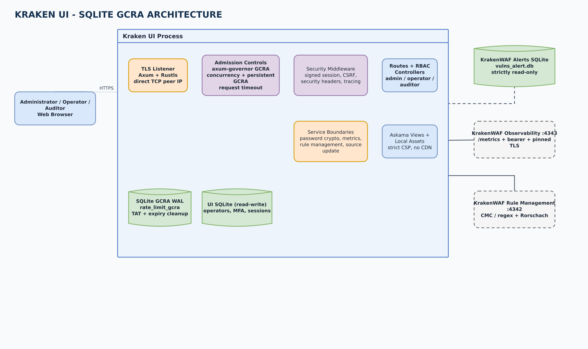
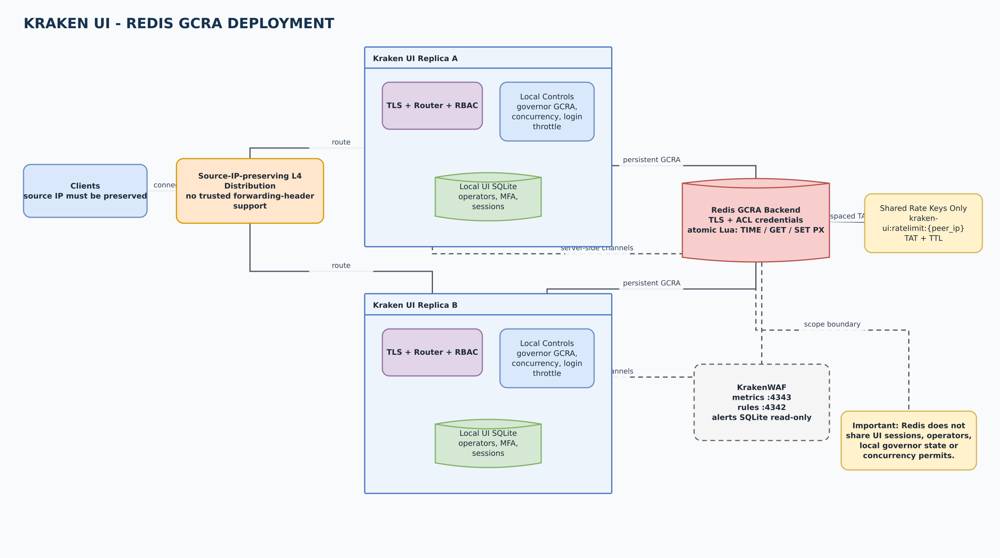
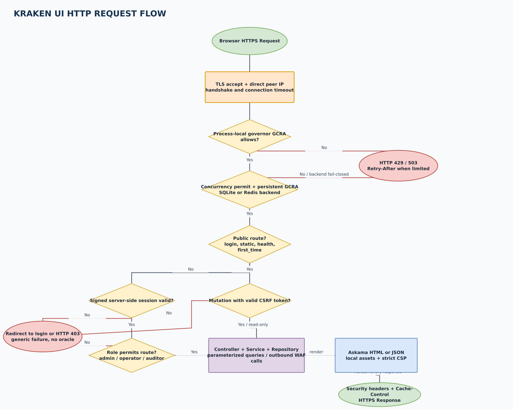
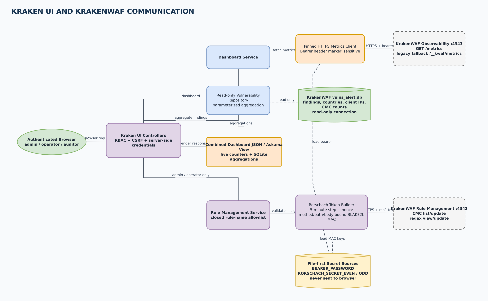

# Kraken UI visual architecture

These diagrams describe the runtime architecture at commit `1b52fc4`. The
editable sources use draw.io XML and all labels are in English.

> Kraken UI implements **GCRA** (Generic Cell Rate Algorithm). "GRCA" is a
> common transposition, but GCRA is the canonical term used by the code.

## Diagram set

| View | Purpose | Preview | Editable source |
| --- | --- | --- | --- |
| SQLite architecture | Single-instance deployment with local governor plus persistent SQLite GCRA | [PNG](diagrams/kraken-ui-sqlite-architecture.png) | [draw.io](diagrams/kraken-ui-sqlite-architecture.drawio) |
| Redis architecture | Shared persistent GCRA across replicas and the remaining per-replica state | [PNG](diagrams/kraken-ui-redis-architecture.png) | [draw.io](diagrams/kraken-ui-redis-architecture.drawio) |
| HTTP request flow | Middleware order, authentication, CSRF, RBAC and controller dispatch | [PNG](diagrams/kraken-ui-request-flow.png) | [draw.io](diagrams/kraken-ui-request-flow.drawio) |
| KrakenWAF integration | Metrics, read-only findings and Rorschach-authenticated rule management | [PNG](diagrams/kraken-ui-krakenwaf-integration.png) | [draw.io](diagrams/kraken-ui-krakenwaf-integration.drawio) |

## SQLite GCRA architecture

Every request first crosses process-local `axum-governor`, then the non-queuing
per-IP concurrency gate and the persistent GCRA decision. In the default mode,
GCRA state is stored in `db/kraken-ui-ratelimit.sqlite` using WAL and immediate
transactions. The UI's own `db-ui` database is separate and read-write; it
stores operators, MFA material and revocable sessions. KrakenWAF's
`vulns_alert.db` is a third database opened strictly read-only.

## Redis GCRA architecture

Redis replaces only the persistent GCRA backend. An atomic Lua script uses
Redis `TIME`, `GET` and `SET PX` over TLS with ACL credentials loaded
file-first. The outer governor, concurrency gate, login throttles, UI database
and session store remain per replica. Redis therefore coordinates request
allowance but does not make the rest of Kraken UI state distributed.

Kraken UI keys all IP controls on the direct TCP peer and ignores forwarding
headers. A multi-replica frontend must preserve the original source IP; a
conventional reverse proxy otherwise collapses all users into one limiter key
and one audited client address.

## HTTP request flow

Public routes are limited to login, static assets, health and the one-shot
bootstrap endpoint. Authenticated routes load a signed server-side session and
then apply role guards: admin for ACL and updates, admin/operator for rule
management, and admin/operator/auditor for the read-only console. Mutating
requests additionally require CSRF verification. Security headers wrap every
response, including errors and redirects.

## KrakenWAF communication

Kraken UI consumes KrakenWAF through three independent boundaries:

1. `GET /metrics` on the dedicated `:4343` observability listener over pinned
   HTTPS, optionally attaching the shared bearer token. The legacy
   `/__kwaf/metrics` path is attempted only as a compatibility fallback.
2. Direct read-only access to `logs/db/vulns_alert.db` for findings, countries,
   client IPs and CMC aggregations. The UI cannot modify this database.
3. CMC and managed-rule operations on `:4342`, each signed server-side with a
   body-, method- and path-bound Rorschach token. Browser clients never receive
   bearer or Rorschach secrets.

The dashboard combines live Prometheus counters with read-only SQLite
aggregations. Rule-management requests are available only to administrators and
operators; auditors remain read-only.
